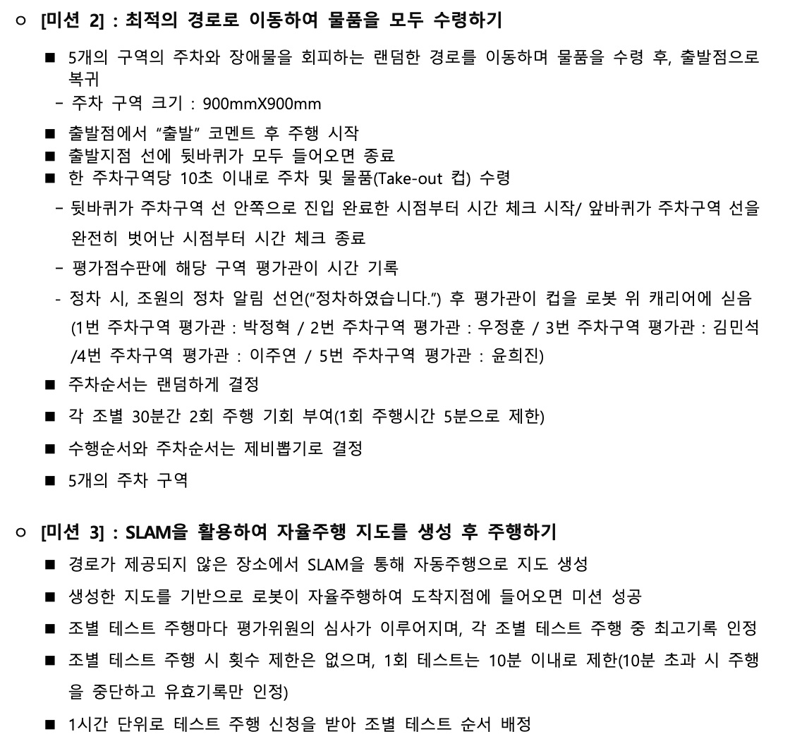

# 광운대학교 자율주행 로봇 제어 테크니션 양성과정

> ## 교육 기간

    2022.01.10~2022.05.09

> ## 구성원

- [안승수](https://github.com/ssahn0806) : 로봇 구동을 위한 알고리즘 수정 및 개발
- [전우성](https://github.com/jws0806) : 실제 로봇 구동을 위한 업무 수행 및 로봇 관리
- [김유경](https://kr.linkedin.com/in/yookyung-kim-a9b417121) : 전략 실행을 위한 자료조사 및 진행상황 기록
- [이동현](https://github.com/hyunkidong) : 문제 해결과 성능 개선을 위한 전략 수립

> ## My Role 🙋‍♂️

    Algorithm
    - Lidar 센서 Topic 활용하여 장애물 회피 및 이동 Logic 구현
    - 물품 수령 지점 도착시 조명 센서 ON/OFF Topic Logic 구현
    - Mapping이 이뤄지지 않은 환경에서 explore_lite 파라미터 튜닝

> ## 제2회 자율 주행 경진대회 대상 🏆

    수여기관 : 주식회사 위고로보틱스
    지원기관 : 고용노동부, 광운대학교 혁신인재양성사업단

> ## 대회 내용
>
> |               설명1                |               설명2                |
> | :--------------------------------: | :--------------------------------: |
> |  |  |

> ## 관련 영상
>
> |                              미리 보기                               |                          링크                           |
> | :------------------------------------------------------------------: | :-----------------------------------------------------: |
> |  | <h2>[실습 영상 보기](https://youtu.be/iEOBzSCRTQ8)</h2> |
> |  | <h2>[대회 영상 보기](https://youtu.be/t9EY2ZlXYHo)</h2> |
